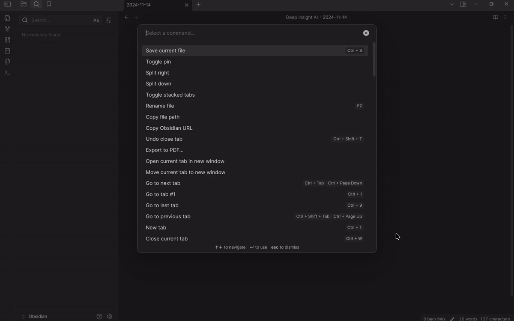

<div align="center">

# `Deep Insight`


<br />


[](https://opensource.org/licenses/MIT)

<p class="align center">
<h4><code>Deep Insight</code> turns your Obsidian vault into actions and insights with AI-powered patterns.</h4>
<h4>Transform <a href="https://obsidian.md/">Obsidian</a> notes into a powerhouse of actionable tasks and insights. Use AI with <a href="https://github.com/danielmiessler/fabric">Fabric</a> patterns, to uncover what truly matters to you.</h4>
</p>

[Key Features](#key-features) •
[Configuration](#configuration) •
[How to Use](#how-to-use) •
[Pattern-Based Analysis](#pattern-based-analysis) •
[Customization](#customization) •
[FAQ](#faq)

<br/>



</div>

## Navigation
- [Deep Insight](#deep-insight)
  - [Key Features](#key-features)
  - [Installation](#installation)
  - [Configuration](#configuration)
  - [How to Use](#how-to-use)
  - [Pattern-Based Analysis](#pattern-based-analysis)
  - [Customization](#customization)
    - [Custom Prompts](#custom-prompts)
    - [AI Models](#ai-models)
  - [Contributions](#contributions)
  - [FAQ](#faq)

## Key Features

- 🤖 Powered by Claude 3.5 and OpenAI GPT-4o AI models (Sonnet, Haiku, GPT-4o and GPT-4o mini)
- 📝 Analyzes every Markdown file in your vault (you can exclude chosen folders)
- 🎯 Prioritizes tasks based on note context and your own **core values, goals and beliefs**. 
- 🎯 Pattern-based analysis using [Fabric](https://github.com/danielmiessler/fabric) patterns
- 🔄 Context menu integration for quick pattern execution
- ✅ Extracts tasks and actionable insights using customisable prompts
- ⚡ Processes large vaults in manageable chunks / batches
- 💰 Provides cost estimates for AI usage

*Note: Only markdown files (.md) are analyzed; other file types like PDFs, images, etc., are excluded.*

## Your Vault Is a Goldmine — But Are You Missing What Matters?

Inside your vault lies:

- Tasks and commitments buried in daily notes
- Brilliant ideas waiting to be rediscovered
- Patterns and themes you haven’t spotted
- Follow-ups silently slipping through the cracks

Deep Insight eliminates the chaos and brings clarity:
- Analyzes every Markdown note with AI-driven prompts
- Extracts actionable tasks tailored to your goals
- Finds recurring themes and big-picture insights
- Surfaces forgotten deadlines and overlooked priorities
- Delivers insights, using [Fabric](https://github.com/danielmiessler/fabric) patterns.

Let Deep Insight be your personal assistant, surfacing the most important insights—aligned with your **goals, values, and beliefs** — so you never lose sight of what truly matters.

## Installation

1. Open Obsidian Settings
2. Navigate to "Community Plugins" and enable it
3. Click "Browse" and search for "Deep Insight"
4. Click "Install" and enable the plugin
5. Enable Patterns in order to use [Fabric](https://github.com/danielmiessler/fabric) patterns
6. Install Patterns, they will be available in a "Deep Insight Fabric Patterns" folder

Note: Alternatively, see [docs](./docs) on how to install latest version manually.

## Configuration

1. Get your API key from [Anthropic](https://console.anthropic.com/settings/keys) or [OpenAI](https://platform.openai.com/api-keys)
2. Open the plugin settings within Obsidian
3. Enter your API key
4. Configure additional settings:
   - Choose either Claude Sonnet, Haiku or GPT 4o/mini model
   - Exclude certain folders (if needed in a larger vaults)
   - Customize prompts
      - **User prompt is where you define your mission, goals and movitation** and any additional instructions. You are encouraged to change this prompt. 
      - System prompt defines how Deep Insight will process the files to extract actions
   - Install Patterns, to take advantage of [Fabric](https://github.com/danielmiessler/fabric) within your Obsidian
   - Enable cost tracking for AI estimates (enabled by default)
5. Access advanced settings:
   - Test mode to reduce costs during experimentation with prompts
   - Max tokens per request (default 100k; reduce if needed)
   - Retry attempts for processing large vaults more smoothly

## How to Use

1. Open any note where you want to insert generated tasks (like your daily note)
2. Select with the cursos the location where generated tasks should be inserted
3. Open the Command Palette (Cmd/Ctrl + P)
4. Search for "Deep Insight: Generate Insights from Notes"
5. The plugin will generate tasks/insights and insert them in your chosen location

## Pattern-Based Analysis

### Using Patterns

1. Install patterns from settings
2. Right-click any file/folder in explorer or current editor
3. Select "Deep Insight: Run Pattern"
4. Choose a pattern to analyze your content
5. The results will appear in your currently selected note

### Pattern Structure

Patterns are stored in Patterns folder (configurable):

```
patterns/
├── pattern-name/
│   ├── system.md    # System instructions
│   └── user.md      # Optional user context
└── single-file-pattern.md
```
All patterns are crowdsourced AI prompts adapted from [Fabric patterns](https://github.com/danielmiessler/fabric/tree/main/patterns). Due to Obsidian plugin size limitations, only selected patterns were included in this plugin. Feel free to add manually any other Fabric patterns by simply copy/pasting them into "Deep Insight Fabric Patterns" folder.

### Custom Patterns

Create custom patterns by:

1. Creating a new folder in "Deep Insight Fabric Patterns" directory
2. Adding "system" note with AI instructions (Obsidan will name it system.md automatically)
3. Optional: Add user.md for specific context
4. Or add single .md files for simpler patterns directly to the parent "Deep Insight Fabric Patterns" folder

### Custom Prompts

In addition to using Fabric patterns, we have two global patterns/prompts allowing for convenient TODO actions generation without having to select individual patterns:

- **User Prompt:** Here is where you define **your mission, purpose, goals and beliefs** and any additional instructions. These goals will be provided as a prompt to every call into AI, so whatever action you take the AI will always be aware of your goals.
- **System Prompt:** Defines how the AI approaches analysis—like instructions for a personal assistant. Customize to set task formats, note categorizations, priorities, style and a template for generated action items.

### How to Set Custom Prompts

1. Create notes in your vault for each type of prompt
2. Link them in the plugin settings using "Select Note"
3. Once the prompt note was selected, you can edit it directly as Obsidian note as needed

### AI Models

- **Claude 3.5 Sonnet:** Best for detailed analysis and task extraction
- **Claude 3.5 Haiku:** Affordable task generation for smaller note sets
- **OpenAI GPT 4o:** OpenAI Advanced Model, for detailed analysis and task extraction
- **OpenAI GPT 4o mini:** OpenAI Affordable Model, for quick task extraction 

## Contributions

Contributions are welcomed! For major changes, please start by opening an issue to discuss your ideas.
For development notes see [docs](./docs)

## Support 

Encounter an issue? Here’s what you can do:
1. Check the [FAQ](#faq) section
2. Submit an issue through GitHub
3. Troubleshoot using the plugin's error handling features and check console logs

## FAQ

### Q: Is the AI controlling me through my tasks?
A: AI is just a glorified note-reader that reminds you of commitments you already wrote. No mind control here - unless you count being reminded of that project deadline you tried to forget. You're still the one calling the shots... for now.

### Q: Why aren’t tasks being generated?
A: Check if:
1. Your API key is correctly set
2. You have an active internet connection
3. Folders aren’t accidentally excluded in the settings

### Q: How exactly AI aligns generated actions with my own goals and values?
A: First step is to define your own mission, goals, values and long term objectives in the User Prompt. Deep Insight plugin will prioritize tasks that directly support your core values and goals. Update the User Prompt in settings or link it to a custom note that reflects your goals and priorities. You can use Test Mode to tweak prompts—this processes just a handful of files per run, making it fast and easy to fine-tune the prompts.

### Q: What file types does the plugin process?
A: The plugin only processes Markdown (.md) files. Other file types (images, PDFs, etc.) are ignored to keep the analysis focused and efficient.

### Q: How expensive is it to run?
A: It’s affordable with control in your hands. For my own vault with thousands of notes from the last few years - using GPT-4o mini, it’s around $0.15 per run — roughly $5/month for daily reviews. Larger vault? You might want to exclude folders in settings for big savings. Prefer a more advanced and pricier model? Costs can rise. The plugin estimates costs upfront—if it’s too high, close Obsidian while the plugin is running (this will stop processing). Reopen, tweak exclusions in settings, and try again.

### Q: How does chunking work?
A: Chunking (batching) helps by processing notes in smaller sections to:
1. Handle large vaults efficiently
2. Stay within API context token limits
3. Maintain context across related notes

It might take a few minutes to process a larger vault. For best results think carefully whether there are more folders you can exclude from processing. Using more affordable model (GPT-4o mini or Haiku can help reduce costs). 

### Q: Can I integrate other AI models?
A: The plugin currently supports Claude 3.5 and OpenAI GPT-4o models. Pull requests are gladly accepted.

### Q: Should I use OpenAI or Anthropic?
A: While both AI providers work quite well, OpenAI tends to have more strict API quotas, especially with the GPT-4o model. If you see frequent errors related to hitting OpenAI quota limits, you might try GPT-4o mini or Anthropic.

### Q: How is my data handled?
A: Your notes are transferred only between your Obsidian vault and Anthropic's Claude / OpenAI. No data is stored or transmitted elsewhere, ensuring complete privacy.

Both OpenAI and Anthropic do not use data submitted via API for training, unless user specifically opted in.

## License

[MIT](LICENSE)

## Credits

This project and it's mission was inspired by [Fabric](https://github.com/danielmiessler/fabric), an open-source framework for human-AI augmentation.

`Deep Insight` was created by <a href="https://www.linkedin.com/in/radekmaciaszek/" target="_blank">Radek Maciaszek</a> in November of 2024.

