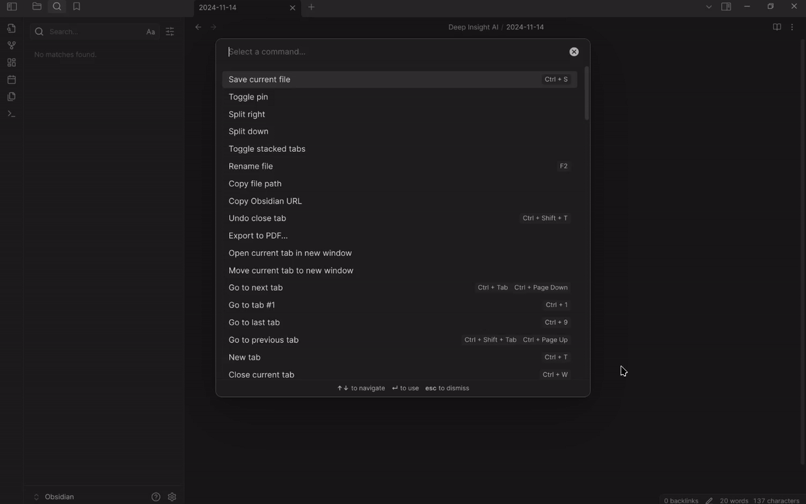

<div align="center">

# `Deep Insight`


<br />

 
[](https://opensource.org/licenses/MIT)

<p class="align center">
<h4>Transform <a href="https://obsidian.md/">Obsidian</a> notes into a powerhouse of actionable tasks and insights. Use AI with <a href="https://github.com/danielmiessler/fabric">Fabric</a> patterns, to uncover what truly matters to you.</h4>
</p>

[Features](#key-features) •
[Setup](#setup) •
[How to Use](#how-to-use) •
[FAQ](#faq)

<br/>



</div>

## Navigation
- [Deep Insight](#deep-insight)
  - [Key Features](#key-features)
  - [Setup](#setup)
  - [How to Use](#how-to-use)
  - [Pattern-Based Analysis](#pattern-based-analysis)
  - [Customization](#customization)
  - [Contributions](#contributions)
  - [Support](#support)
  - [FAQ](#faq)

## Key Features

Transform your Obsidian vault into actionable insights using AI-powered patterns. Deep Insight analyzes your notes to uncover tasks and patterns that align with your goals and values.

- 🤖 Powered by Claude 3.5, OpenAI GPT-4o, Ollama (local), and Claude Code (via bridge)
- 📝 Analyzes every Markdown file in your vault (you can exclude chosen folders) or selected folders/notes
- 🎯 Generates prioritized tasks based on note context and your own **core values, goals and beliefs**. 
- 🧬 Pattern-based analysis using [Fabric](https://github.com/danielmiessler/fabric) patterns
- 🔄 Context menu integration for quick pattern execution
- ⚡ Processes large vaults in manageable chunks / batches
- 💰 Provides cost estimates for AI usage  

*Note: Only markdown files (.md) are analyzed; other file types like PDFs, images, etc., are excluded.*

## Setup

1. Install via Obsidian Community Plugins or manually
2. Choose your AI provider:
   - **Anthropic** — Get API key from [Anthropic Console](https://console.anthropic.com/settings/keys)
   - **OpenAI** — Get API key from [OpenAI Platform](https://platform.openai.com/api-keys)
   - **Ollama (Local)** — Install [Ollama](https://ollama.com), no API key needed, zero cost
   - **Claude Code (Local)** — Uses your existing Claude Pro/Max subscription via a local bridge (see below)
3. Configure in plugin settings:
   - Select provider and enter API key (if needed)
   - Choose AI model
   - Set excluded folders
   - Customize prompts
   - Install Fabric patterns

Note: Alternatively, see [docs](./docs) on how to install latest version manually.

### Claude Code Bridge Setup

If you have a Claude Pro or Max subscription, you can use Claude Code as your AI backend at no extra API cost:

1. Install [Bun](https://bun.sh) if you don't have it
2. Start the bridge server:
   ```bash
   cd /path/to/obsidian-deep-insight
   bun bridge-server.ts
   ```
3. In Obsidian: Settings → Deep Insight → Provider → "Claude Code (Local)"
4. Start chatting — uses your existing subscription

**Trade-offs:** The bridge adds 5-15s latency per message (CLI spawn overhead). For faster responses, use direct API keys or Ollama. The bridge is best for occasional use where you want to avoid extra API costs. See the [architecture docs](docs/) for a full comparison.

## How to Use

1. Open any note where you want to insert generated tasks (like your daily note)
2. Select with the cursos the location where generated tasks should be inserted
3. Open the Command Palette (Cmd/Ctrl + P)
4. Search for "Deep Insight". Use "Generate Insights and Tasks from Notes" option to generate tasks or "Run Pattern" to analyse your vault with a specific Fabric pattern.
5. Alternatively, right click on a folder or a note and choose "Run Pattern" option to analyse selected notes with Fabric patterns.
5. The plugin will generate tasks/insights and insert them in your chosen location

## Pattern-Based Analysis

## Usage

1. Place cursor where you want to insert generated content
2. Open Command Palette (Cmd/Ctrl + P)
3. Choose "Generate Insights and Tasks from Notes" or "Run Pattern"
4. Alternatively, right-click on files/folders to run patterns

## Patterns

Patterns are AI prompts that analyze your content in specific ways:

1. Install sample patterns from plugin settings
2. Download more from [Fabric](https://github.com/danielmiessler/fabric)
3. Create custom patterns in the "Deep Insight Patterns" folder

Pattern structure:
```
patterns/
├── pattern-name/
│   ├── system.md    # System instructions
│   └── user.md      # Optional user context for a given pattern
```

## Contributions

Contributions are welcomed! For major changes, please start by opening an issue to discuss your ideas.  
For development notes see [docs](./docs)

## Support 

Encounter an issue?
1. Check the [FAQ](#faq) section
2. Submit an issue through GitHub
3. Troubleshoot using the plugin's error handling features and check console logs  

## FAQ

### Q: Is the AI controlling me through my tasks?
A: AI is just a glorified note-reader that reminds you of commitments you already wrote. You're still the one calling the shots... for now.

### Q: Why aren't tasks generating?
A: Check these three things:
- API key is valid
- Internet connection is active

### Q: How does it align with my goals?
A: Define your mission, values, and objectives in the User Prompt - the plugin prioritizes tasks that support these core principles.

### Q: What files can it process?
A: Markdown (.md) files only. Other formats are excluded for focused analysis.

### Q: What are the costs?
A: On my personal vault (hundreds of notes):
- ~$0.15 per run using GPT-4o mini
- ~$5/month for daily reviews
- **$0/month** with Ollama (local, free) or Claude Code bridge (uses existing subscription)
- Cost estimates are shown upfront, YMMV
- If your estimated costs are too high, stop processing anytime by closing Obsidian
- Reduce costs by excluding folders in settings

### Q: How does chunking work?
A: Large vaults are processed in smaller batches to:
- Stay within API limits
- Maintain context
- Process efficiently
Expect a few minutes for larger vaults.

### Q: Which AI provider should I choose?
A: It depends on your priorities:
- **Cheapest:** Ollama (free, runs locally) or Claude Code bridge (uses existing subscription)
- **Fastest:** OpenAI or Anthropic direct API (1-2s per response)
- **Most private:** Ollama (nothing leaves your machine)
- **No extra cost:** Claude Code bridge (if you already have Claude Pro/Max)

OpenAI has stricter quotas. If hitting limits with GPT-4o, try GPT-4o mini or Anthropic.

### Q: Is my data secure?
A: Yes - notes are transferred securely between your vault and the AI providers (Anthropic/OpenAI). No data is stored elsewhere or used for training without explicit opt-in. With Ollama or Claude Code bridge, your data never leaves your machine (except through your existing Claude subscription for the bridge).

Both OpenAI and Anthropic do not use data submitted via API for training, unless user specifically opted in.

## License

[MIT](LICENSE)

## Credits

This project and it's mission was inspired by [Fabric](https://github.com/danielmiessler/fabric), an open-source framework for human-AI augmentation.

`Deep Insight` was created by <a href="https://www.linkedin.com/in/radekmaciaszek/" target="_blank">Radek Maciaszek</a> in November of 2024.